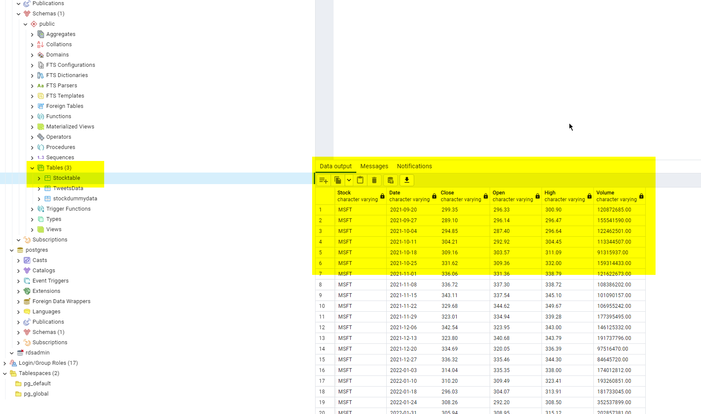
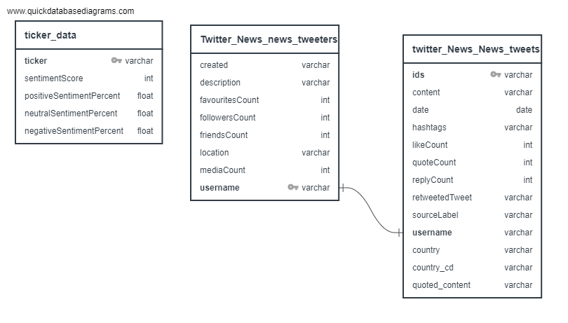

# capstone
## Stock Market Analysis
## Project Overview 
### <ins>Background</ins> 
By utilizing twitter sentiment analysis and linear regression, we tend to able to analyze data provided on twitter to forecast stock market closing prices.

In this project, we have applied sentiment analysis and statistical machine learning models. These models are used to envision the correlation between the tweets which are extracted from twitter. We have performed sentiment analysis of the twitter data based on a whole day as well as based on an hourly basis to analyze the effect it has on stock market prediction. 

## An overview of the process flow of our project is as follows:

### Data Collection

For this purpose, we are collectinng and normalizing stock data for the the database so it can be used in our machine learning mdodel. in order to do this, we are obtaining data microdosft excel's stock history function, cleaning the data in python using numpy and pandas and outputting it as csv files, and using postgresql to create tables for cleane CVSs for or AWS data base.  
Our data base cnfiguration has takes steps as subsequently;

#### <ins>Base Database Configuration</ins>

- Created AWS Relational Database instance.
- Configured inbound rules for connection.
- Confirmed pgSQL (pgAdmin) connection to the server. 
- Created S3 buckets to hold data. 
- Configured buckets to be publicly accessible.
- Uploaded data to buckets.
- Created Tables within Database. 
- Attempted to classify Record/Variables for Stock Data.
- Installed Apache Spark & PySpark. 
- Attempted to extract data from S3 buckets in Amazon
- Came across errors. 
- Attempted manual import of data into tables. Did not work as expected.
	- Determined tables value types causing error for import.
	
(Figure 1) 
:------------------------------------------:|	
	 
	 Sample Data

(Figure 2) | (Figure 3)
:------------------------------------------:| :-------------------------------------:	
 | 
Active RDS Instace.  | RDS Database Instace-TickerDB..

(Figure 4) 
:------------------------------------------:|	
	 
	 Database ERD

Notes/Things to do:

- Need to troubleshoot error for Apache Spark.
- Need to classify column variable correctly after data import.

(Figure 5) 
:------------------------------------------:|	
	 
	Arache Spark Error

### <ins>Data Preprocessig</ins>

The stock market data is collected using yfinance API and tweets are fetched from twitter using GetOldTweets API. In this step the preprocessing of the tweets such as removing stop words, hyperlink and other steps are carried out.

Stock prices data collected  lacks weekends and public holidays when the market is closed. Stock data 
follows a concave function. Therefore, if the stock in a day is x and the next  is y with some missing. The first missing value is determined to be (y+x)/2 and the same metodology is used to determine the missing values.

Tweets contain acronyms, unnecessary data like pictures and URL’s. to do processing of preliminary tweets we utilized Tokenization.

Tokenization: Tweets are broken down into words based on the space and unrelated symbols. We form a list of individual words for each tweet.

Sentiment Analysis: Every tweet is given a sentiment score which shows if the tweet is positive, negative or neutral.

We used following for the sentiment analysis and data preprocssing;

#### <ins>import dependencies</ins>
import pandas as pd
import numpy as np
import tweepy
import nltk
from textblob import TextBlob
from nltk.sentiment.vader import SentimentIntensityAnalyzer
import pymysql
from sqlalchemy import create_engine

#### <ins>Storing and cleaning tweet text/ins>

We have made 4 lists consisting tweetList, poslList, negList and neuList and apended the data accordingly and calculated the sentiment score of each of them. the lengths of each List was devided by its repective twetlist and the result was presented as following.
	
​positive sentiment: 32.93%
negative sentiment: 27.54%
neutral sentiment: 39.52%
Overall sentiment is neutral

